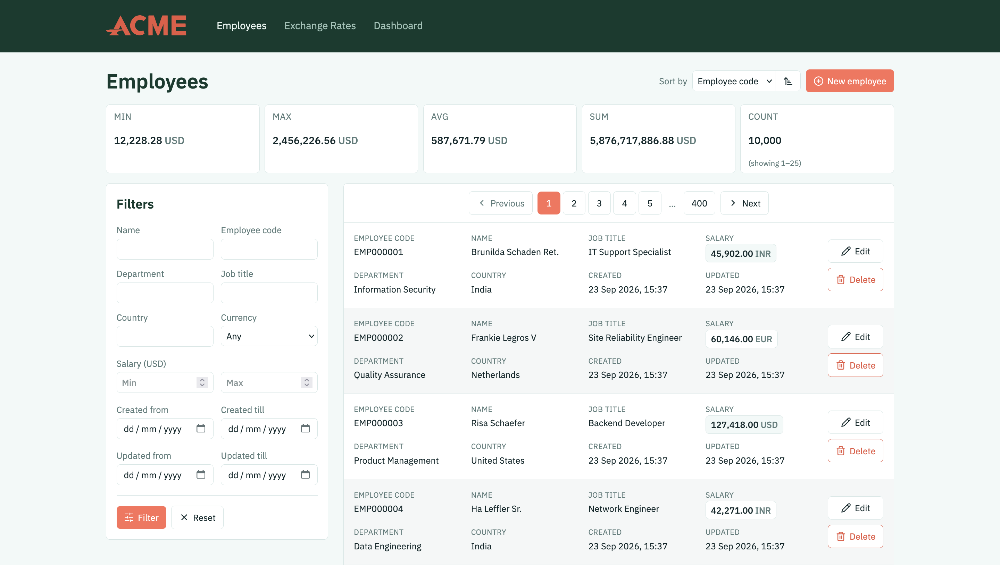
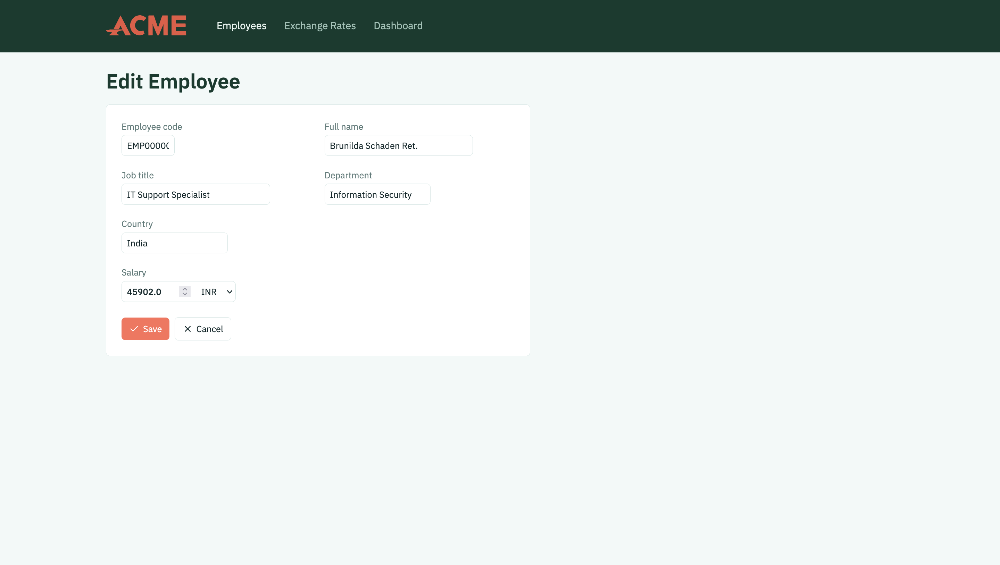
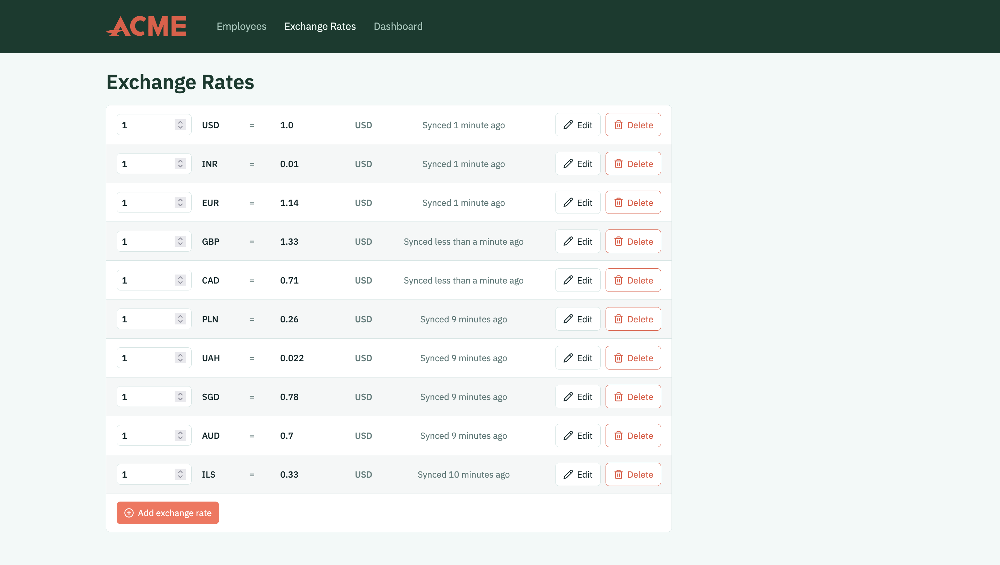
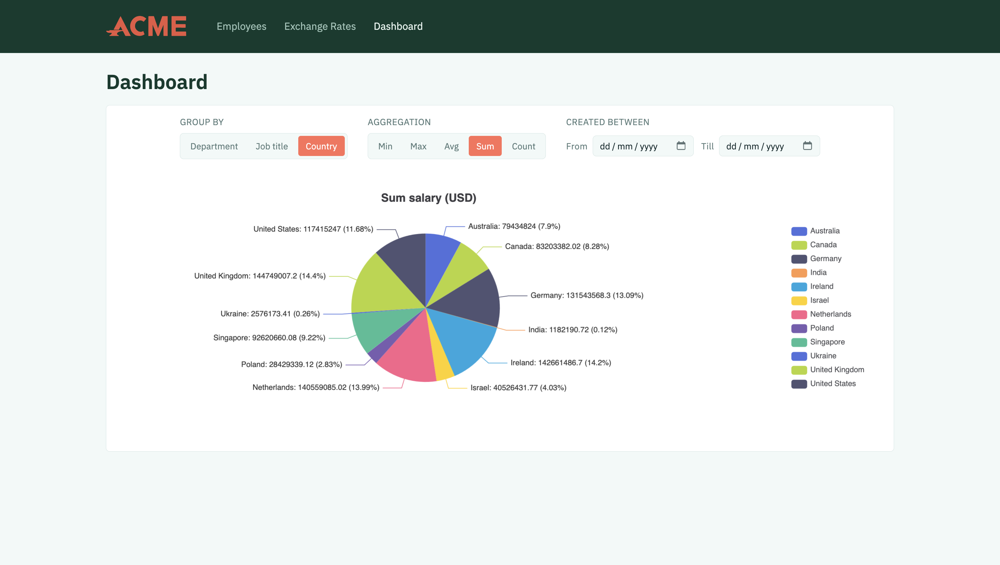
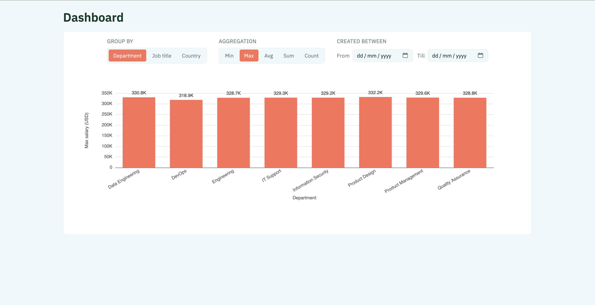

# Payscope

Live at **[https://acme-payscope.onrender.com](https://acme-payscope.onrender.com)**.

Payscope is a web-based employee salary management application built for a single HR manager overseeing a database of 10,000+ employees. It replaces manual spreadsheet workflows with:

- An **employee listing** page with search/filter across department, country, job title, currency, and salary/date ranges, plus a live aggregate bar (min/max/avg/count/sum) that reflects the active filter set.
- An **exchange rates** page for managing the currencies employee salaries are normalized against, including a live "amount → USD" calculator on each row.
- A **dashboard** with a single chart driven by three controls (group by / aggregation / created-at range) instead of a fixed set of charts — `sum`/`count` render as a pie chart, `min`/`max`/`avg` as a bar chart.
- Background recalculation: editing an exchange rate enqueues a job that recomputes `normalized_usd_salary` for every employee in that currency, so the request isn't blocked on it.

See [`docs/requirements.md`](docs/requirements.md) for the full functional spec.

## Screenshots

| Employee listing | Edit employee |
| --- | --- |
|  |  |

| Exchange rates | Dashboard — pie chart |
| --- | --- |
|  |  |



## Tech stack

- **Ruby** 4.0.7 (see [`.ruby-version`](.ruby-version))
- **Rails** ~> 8.1.3
- **PostgreSQL** in development/test, **CockroachDB** in production (via the `activerecord-cockroachdb-adapter` gem)
- **Hotwire** (Turbo + Stimulus) for interactivity, no SPA framework
- **Tailwind CSS v4** via the `tailwindcss-rails` standalone binary — no Node/npm required
- **Importmap** for JavaScript — no JS bundler/build step
- **ECharts** (pinned via importmap) for the dashboard chart
- **Solid Queue** / **Solid Cache** / **Solid Cable** — all database-backed, so no Redis is required
- **RSpec** for tests, **Rubocop** (omakase style) for linting, **Brakeman** and **bundler-audit** for security scanning

## Prerequisites

- Ruby 4.0.7 (matching [`.ruby-version`](.ruby-version) — install via `chruby`, `rbenv`, `asdf`, etc.)
- Bundler (`gem install bundler` if not already available)
- A running PostgreSQL server, reachable with the credentials in [`config/database.yml`](config/database.yml)

## Setup

```sh
bin/setup --skip-server
```

This installs gem dependencies (`bundle install`), prepares the database (`bin/rails db:prepare`), and clears old logs/tmp files. Omit `--skip-server` to also boot the dev server (`bin/dev`) once setup finishes.

## Seeding the database

Seed data is generated as CSVs first, then imported — this keeps a record of what was generated (including deliberately invalid rows) separate from the import itself:

```sh
# Generate exchange rate + employee CSVs into db/seed_data/
script/generate_seed_data --exchange-rates 10 --employees 10500 --invalid-employees 500

# Import those CSVs into the database
bin/rails db:seed
```

Rejected rows from the import are logged to `db/seed_data/import_errors.csv` by default; override the location with `ERROR_LOG_PATH=/some/path.csv bin/rails db:seed`.

## Running the dev server

```sh
bin/dev
```

This runs `Procfile.dev` via Foreman: the Rails server, `tailwindcss:watch` (recompiles CSS on change), and `bin/jobs` (the Solid Queue worker), all together. The app is served at `http://localhost:3000`.

## Running CI locally

```sh
bin/ci
```

This runs the same steps defined in [`config/ci.rb`](config/ci.rb) that back the GitHub Actions workflow: environment setup, Rubocop, `bundler-audit`, `importmap audit`, Brakeman, and the RSpec suite. Individual steps can also be run directly:

```sh
bin/rubocop                                                         # style
bin/bundler-audit                                                   # gem vulnerability audit
bin/importmap audit                                                 # JS dependency vulnerability audit
bin/brakeman --quiet --no-pager --exit-on-warn --exit-on-error      # static security analysis
bundle exec rspec                                                   # test suite
```

## The `docs/` folder

- [`docs/requirements.md`](docs/requirements.md) — the original functional requirements: product goal and scope, core features (listing page, dashboard, CRUD, async recalculation), and the data schema/architecture the app was built against.
- [`docs/planning.md`](docs/planning.md) — the step-by-step build plan and to-do list, from initial models through the current "Code Optimization and Feature Improvements" step. Each completed step links out to a corresponding file in `docs/plans/`.
- [`docs/plans/`](docs/plans/) — one detailed implementation plan per step in `planning.md`, numbered to match (`1_create_tables_and_models.md` through `8_write_a_script_to_seed_the_database.md`). Each describes the approach taken for that step before/while it was built — data model decisions, service boundaries, testing strategy, etc.
- [`docs/design_notes.md`](docs/design_notes.md) — a living visual/interaction design spec, describing the UI _as currently implemented_ (color tokens, typography, component patterns, per-page layout decisions, and the reasoning behind non-obvious choices). Application code refers back to specific sections via `§N` comments (e.g. `docs/design_notes.md §8`), so this file should stay in sync with the UI rather than frozen at time of writing, unlike the point-in-time plans in `docs/plans/`.
- [`docs/decisions.md`](docs/decisions.md) — the _why_ behind architecture/process choices that aren't self-evident from the code, including ones that intentionally depart from `docs/requirements.md` (e.g. `employee.currency` becoming a foreign key instead of a column, CockroachDB in production).

## Deployment

The app deploys to [Render.com](https://render.com). The build step is [`bin/render_build.sh`](bin/render_build.sh), which:

1. Installs gems (`bundle install`)
2. Precompiles and cleans assets (`rake assets:precompile`, `rake assets:clean`)
3. Fetches the CockroachDB Cloud cluster's CA certificate into `~/.postgresql/root.crt` (required for the TLS connection Cockroach expects)
4. Runs pending migrations (`rake db:migrate`)

Production data lives in a single **CockroachDB** cluster (connected via the `DATABASE_URL` env var — see `production:` in [`config/database.yml`](config/database.yml)), rather than the separate SQLite databases Rails' default multi-database setup would otherwise use for the cache/queue/cable backends in production — Solid Cache, Solid Queue, and Solid Cable all share the one primary database instead of `connects_to`-ing dedicated ones. Production credentials (`config/credentials/production.yml.enc`) are encrypted in the repo and decrypted at boot with `RAILS_MASTER_KEY`, which Render provides as an environment variable rather than a checked-in key file.

Background jobs run on **Solid Queue** rather than Sidekiq, and its supervisor runs inside the same Puma process as the web server (`config/puma.rb`, `plugin :solid_queue if ENV["SOLID_QUEUE_IN_PUMA"]`) instead of as a separate worker process/service. See [`docs/decisions.md`](docs/decisions.md#4-solid-queue-in-process-with-puma-instead-of-sidekiq--redis) for the reasoning and the trade-off being made here.
